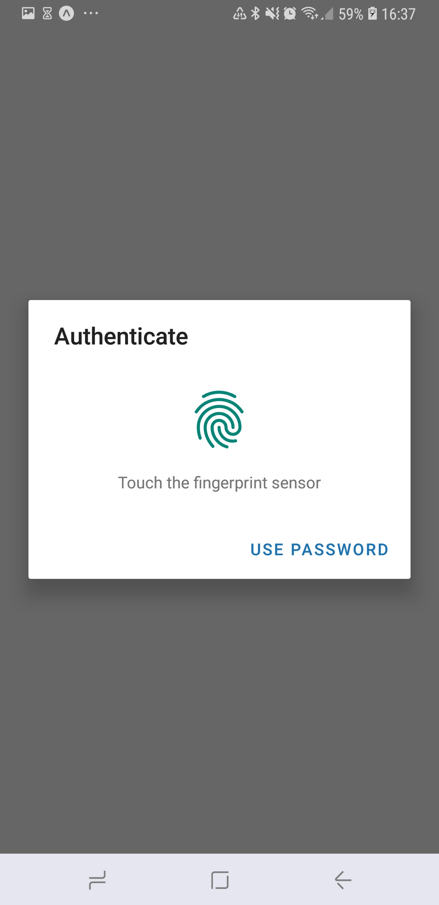
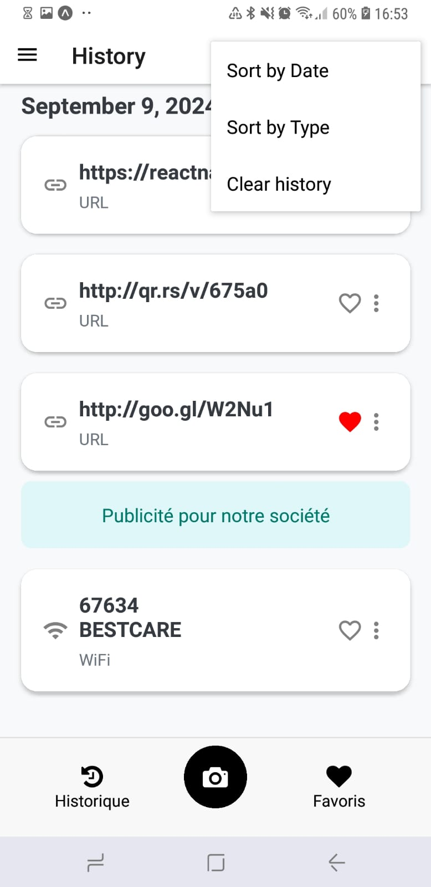

# Fonctionnalités principales

1. **Scan rapide et sécurisé** : Scannez divers types de QR codes en toute sécurité (URLs, texte, contacts, etc.).  
   L'application utilise une interface simple pour capturer rapidement les QR codes et les analyser en toute sécurité.  
   

2. **Vérification des liens** : Analyse des URLs avec VirusTotal pour vérifier la sécurité avant de les ouvrir.  
   Cette fonctionnalité protège l'utilisateur en analysant les liens scannés afin d'éviter toute interaction avec des sites malveillants.

3. **Gestion de l'historique** :  
   Vous pouvez visualiser tous les QR codes que vous avez scannés dans l'historique, les rechercher et marquer certains comme favoris pour y revenir plus facilement.  
   

4. **Personnalisation des paramètres** :  
   Accédez à la section "Paramètres" pour ajuster les notifications, les options de sécurité, ou gérer votre authentification via Google ou empreinte digitale. Cela permet d'adapter l'application à vos préférences de sécurité et d'utilisation.  

---

**Prochaines fonctionnalités à venir** :  
- Génération de QR codes personnalisés.
