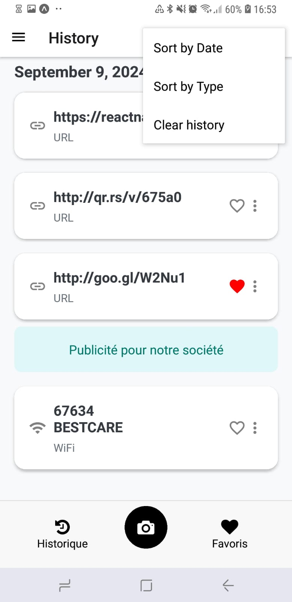

# Gestion de l'historique

L'application conserve un historique de tous les QR codes que vous avez scannés. Vous pouvez y accéder à tout moment via l'onglet "Historique". Cette section vous permet également de rechercher un QR code spécifique ou de marquer des codes comme favoris.

  

