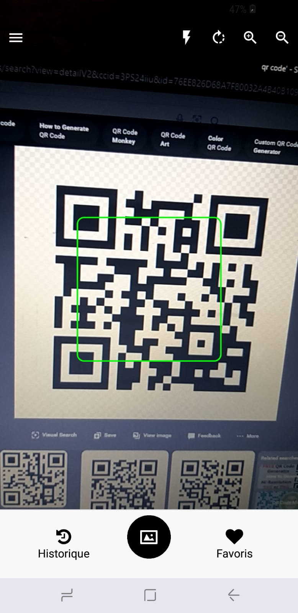

# Utilisation du scanner

L'interface de scan vous permet de capturer des QR codes simplement en pointant votre appareil vers un code QR. Une fois scanné, l'application analysera le contenu et affichera les résultats adaptés (URL, texte, WiFi, etc.).

  

1. Ouvrez l'application.
2. Dirigez la caméra vers un QR code.
3. Attendez que l'application capture et analyse automatiquement le code.

Vous pouvez également activer la lampe torche en cas de faible luminosité.
